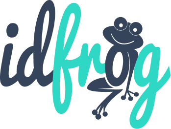

# IdFrog

Ce projet a été réalisé dans le cadre de ma fin de formation avec l'école O'Clock en collaboration avec:
- Nicolas Ortigue https://github.com/NicolasOrtigue
- Paul Greau https://github.com/Paul-Greau
- Ramses Hillah https://github.com/HillahRamses

Le front et le back sont déployés sur render à l'adresse suivante : https://idfrog-front.onrender.com/

La Base de données est hébergée sur Supabase.
